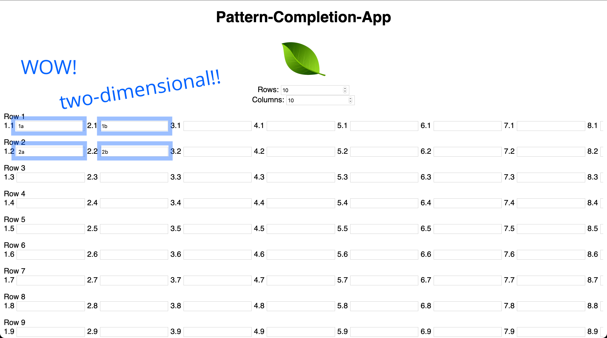
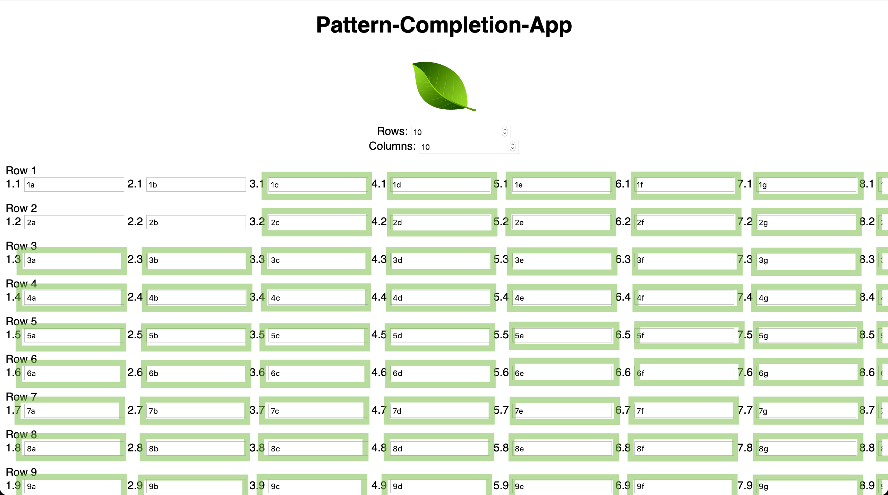
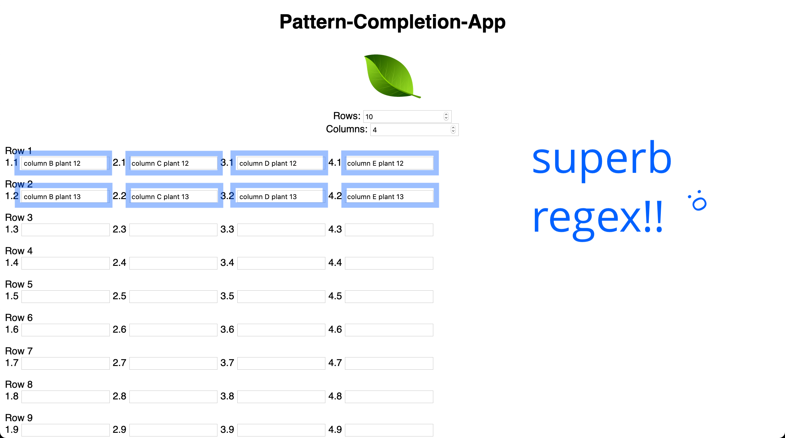
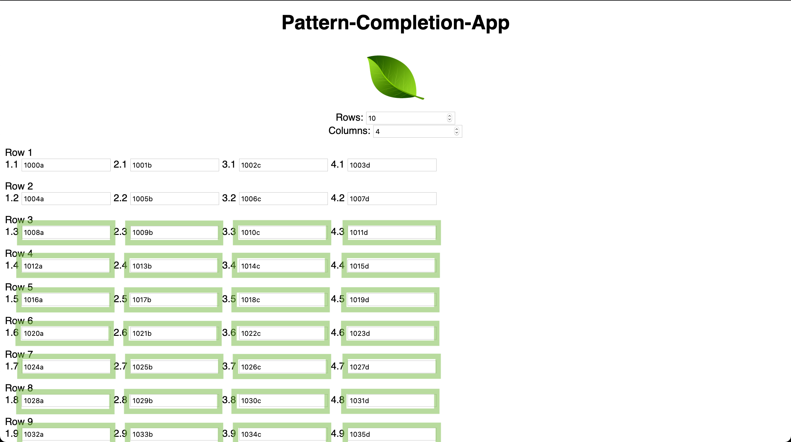
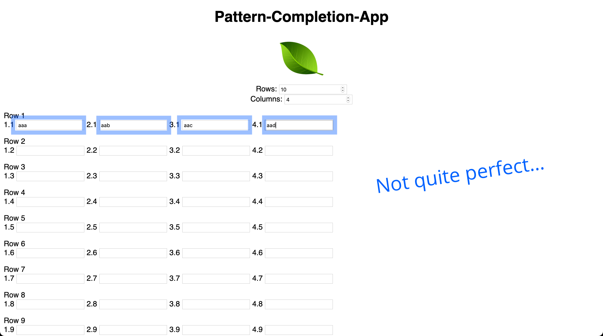
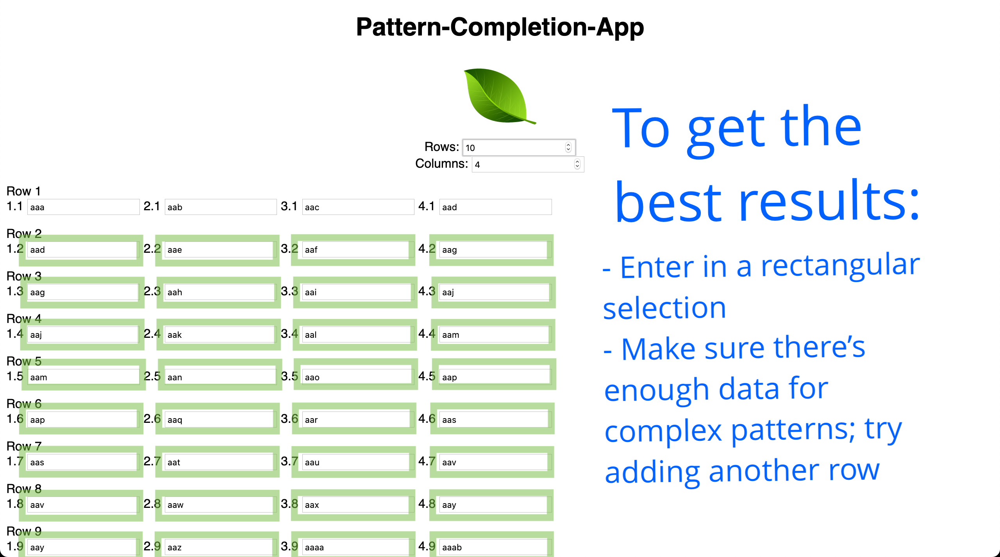

# Pattern Completion App <!-- omit in toc -->

- [About](#about)
  - [Our Team](#our-team)
  - [Using the App](#using-the-app)
- [Contribution Guidelines](#contribution-guidelines)
  - [Submitting a Pull Request (PR)](#submitting-a-pull-request-pr)
  - [After your Pull Request is Merged](#after-your-pull-request-is-merged)
- [Coding Rules](#coding-rules)
  - [Code Style](#code-style)
    - [Python](#python)
    - [HTML/CSS](#htmlcss)
    - [JavaScript](#javascript)
- [Commit Message Guidelines](#commit-message-guidelines)
  - [Commit Message Format](#commit-message-format)
  - [Revert](#revert)
  - [Type](#type)
  - [Scope](#scope)
  - [Description](#description)
  - [Body](#body)
  - [Footer](#footer)
- [References](#references)

## About

This app is a submission for the [WinHacks 2021 competition](https://winhacks-2021.devpost.com/) as challenged by [Splice Digital](https://splicedigital.com/).

### Our Team

- [Alexander Lotz](https://github.com/alexanderlotz/)
- [Emily Chu](https://github.com/mlechu)
- [Ryan Moon](https://github.com/rm00nkh)
- [Sean Kyer](https://github.com/seankyer)

### Using the App
A live demo is available here: https://pattern-completion-app.herokuapp.com/
Some example inputs and outputs are provided below.

---

---

---

## Contribution Guidelines

This project implements strict requirements on code style and quality to maintain a functional development environment.

### Submitting a Pull Request (PR)

1. Fork the project repo.

2. Make your changes in a new git branch:

    If its a new feature

        git checkout -b feature/feature-name main

    If its a bug fix

        git checkout -b fix/fixed-bug-name main

3. Create your patch, **including appropriate test cases**, if any.
4. Follow our [Coding Rules](#coding-rules).
5. Run the full project test suite and ensure that all tests pass.
6. Commit your changes using a descriptive commit message that follows our [commit message conventions](#commit-message-guidelines). Adherence to these conventions is necessary to maintain commit readability and allow for generation of version release notes.

        git commit -a

    Note: the optional commit -a command line option will automatically "add" and "rm" edited files.

7. Push your branch to GitHub:

        git push origin my-fix-branch

8. In GitHub, send a pull request to `main`.

- If changes are necessary then:
- Make the required updates.
- Re-run the project test suite to ensure tests are still passing.
- Rebase your branch and force push to your GitHub repository (this will update your Pull Request):
  
        git rebase master -i
        git push -f

### After your Pull Request is Merged

After your pull request is merged, you can safely delete your branch and pull the changes from the main (upstream) repository:

Delete the remote branch on GitHub either through the GitHub web UI or your local shell as follows:

        git push origin --delete my-fix-branch

Check out the main branch:

        git checkout main -f

Delete the local branch:

        git branch -D my-fix-branch

Update your main with the latest upstream version:

        git pull --ff upstream main

## Coding Rules

To ensure consistency throughout the source code, keep these rules in mind as you are working:

- All features or bug fixes **must be tested** by one or more specs (unit-tests).
- All public API methods **must be documented**.
- All code must adhere to it's language-specific [style guide](#code-style).

### Code Style

All language currently implement their respective Google style guides. Exceptions, if any, are included in the language-specific subsections.

#### Python

This project adheres to the [Google Python style guide](https://google.github.io/styleguide/pyguide.html).

Linting is performed using [PyLint](https://google.github.io/styleguide/pylintrc) (Link starts a download).

#### HTML/CSS

This project adheres to the [Google HTML/CSS style guide](https://google.github.io/styleguide/htmlcssguide.html).

#### JavaScript

This project adheres to the [Google JavaScript style guide](https://google.github.io/styleguide/jsguide.html).

## Commit Message Guidelines

Common convention for git commit messages makes it easy to understand the project history and will enable us to easily generate a project change log. This project adheres to the [Conventional Commits style guide](https://www.conventionalcommits.org/en/v1.0.0/). Key information has been included in the below sections for convenience.

### Commit Message Format

Each commit message consists of a **header** and optionally a **body** and a **footer**. The header has a special format that includes a **type**, **scope**, and **description**:

        \<type>[optional scope]: \<description>

        [optional body]

        [optional footer(s)]

The **header** is mandatory and the **scope** of the header is optional.

Any line of the commit message cannot be longer 100 characters! This allows the message to be easier to read on GitHub as well as in various git tools.

The **footer** should contain a closing reference to an issue if any.

### Revert

If the commit reverts a previous commit, it should begin with `revert:`, followed by the header of the reverted commit. In the body it should say: `This reverts commit <hash>.`, where the hash is the SHA of the commit being reverted.

### Type

Must be one of the following:

- **docs**: Documentation only changes
- **feat**: A new feature
- **fix**: A bug fix
- **perf**: A code change that improves performance
- **refactor**: A code change that neither fixes a bug nor adds a feature
- **style**: Changes that do not affect the meaning of the code (white-space, - formatting, missing semi-colons, etc)
- **test**: Adding missing tests or correcting existing tests

### Scope

The scope should be the name of the project tier affected (as perceived by the person reading the changelog generated from commit messages.)

The following is the list of supported scopes:

- **business-logic**
- **database**
- **front-end**

### Description

The description contains a succinct description of the change:

- use the imperative, present tense: "change" not "changed" nor "changes"
- don't capitalize the first letter
- no dot (.) at the end

### Body

Just as in the **description**, use the imperative, present tense: "change" not "changed" nor "changes". The body should include the motivation for the change and contrast this with previous behavior.

### Footer

The footer should contain any information about **Breaking Changes** and is also the place to reference GitHub issues that this commit Closes.

**Breaking Changes** should start with the word `BREAKING CHANGE:` with a space or two newlines. The rest of the commit message is then used for this.

## References

This project's completion is largely thanks to information gathered from publicly available resources including, but not limited to:

- [Structured Patterns in Python](https://www.python.org/dev/peps/pep-0636/)
- [Making Predictions with Sequences](https://machinelearningmastery.com/sequence-prediction/)
- [Machine Learning - Linear Regression](https://www.w3schools.com/python/python_ml_linear_regression.asp)
- [Next Word Prediction Model](https://thecleverprogrammer.com/2020/07/20/next-word-prediction-model/)
- [Understanding Word N-grams in NLP](https://towardsdatascience.com/understanding-word-n-grams-and-n-gram-probability-in-natural-language-processing-9d9eef0fa058)